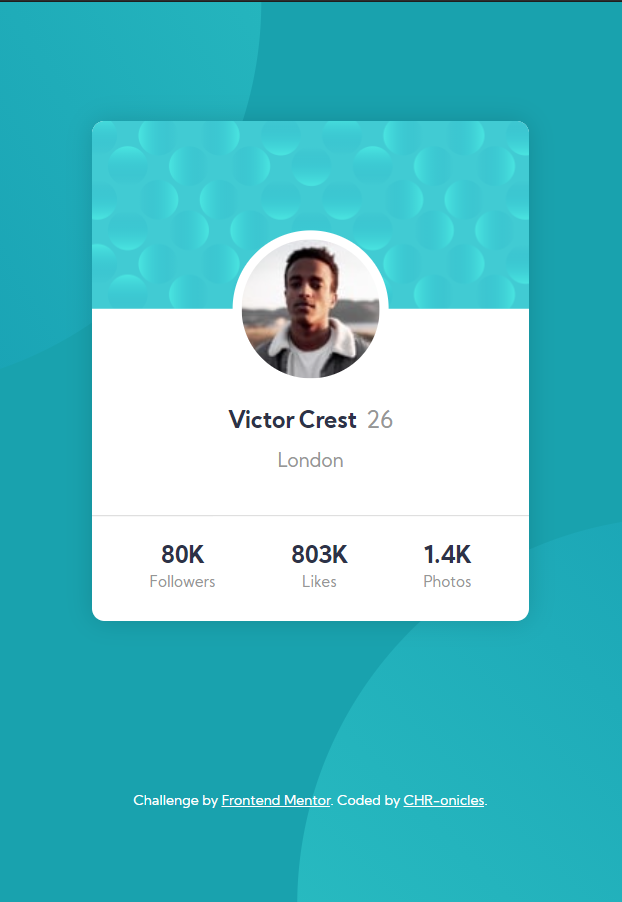

# Frontend Mentor - Profile card component solution

This is a solution to the [Profile card component challenge on Frontend Mentor](https://www.frontendmentor.io/challenges/profile-card-component-cfArpWshJ). Frontend Mentor challenges help you improve your coding skills by building realistic projects. 

## Table of contents

- [Overview](#overview)
  - [The challenge](#the-challenge)
  - [Screenshot](#screenshot)
  - [Links](#links)
- [My process](#my-process)
  - [Built with](#built-with)
  - [What I learned](#what-i-learned)
- [Author](#author)

## Overview

### The challenge

- Build out the project to the designs provided

### Screenshot

### Links

- Solution URL: [My solution](https://github.com/CHR-onicles/FEM-profile-card)
- Live Site URL: [Live site](http://fem-profile-card-nine.vercel.app/)

## My process

### Built with

- Semantic HTML5 markup
- CSS 

### What I learned

I learned how to use the [BEM](https://sparkbox.com/foundry/bem_by_example) naming convention for class names. It's quite a hassle 😅.

## Author

- Website - [CHR-onicles](https://github.com/CHR-onicles)
- Frontend Mentor - [@CHR-onicles](https://www.frontendmentor.io/profile/CHR-onicles)
